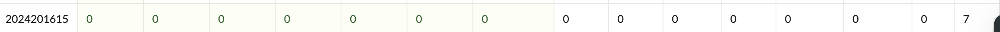

姓名：曹哲博

学号：2024201615

| 总分 | phase_1 | phase_2 | phase_3 | phase_4 | phase_5 | phase_6 | secret_phase |

| ---- | ------- | ------- | ------- | ------- | ------- | ------- | ------------ |

| 7    | 1       | 1       | 1       | 1       | 1       | 1       | 1            |

scoreboard 截图：



<!-- TODO: 用一个scoreboard的截图，本地图片，放到 imgs 文件夹下，不要用这个 github，pandoc 解析可能有问题 -->

## 解题报告

### 技术收获

1.**深入理解汇编语言**：通过本次实验，我从只能看懂简单的 `mov` 指令，进阶到能够分析复杂的循环、递归、跳转表（Switch-Case）以及链表操作。这让我对 x86-64 架构的寄存器使用约定（如 `%rdi` 传参、`%rax` 返回值）有了直观的认识。

2.**掌握 GDB 动态调试**：学会了使用 `disas` 查看反汇编，`x/s`、`x/d` 查看内存数据，以及设置断点（`break`）和单步执行（`ni`）。特别是学会了利用 GDB 在运行时“偷看”寄存器中的正确答案，这比单纯静态分析要高效得多。

### 实验感悟

Bomb Lab 不仅仅是一次作业，更像是一场与计算机底层的对话。它让我明白，高级语言中的简单语句（如 `if`、`for`、指针引用）在底层是如何通过一条条精简的汇编指令实现的。

特别是在解决 **Secret Phase** 时，发现程序居然通过检查 Phase 4 的后缀来触发隐藏逻辑，这种设计让我体会到了黑客攻防中的思维博弈。

Bomb Lab 不仅仅是一次作业，更像是一场与计算机底层的对话。它让我明白，高级语言中的简单语句（如 `if`、`for`、指针引用）在底层是如何通过一条条精简的汇编指令实现的。

特别是在解决 **Secret Phase** 时，发现程序居然通过检查 Phase 4 的后缀来触发隐藏逻辑，这种设计让我体会到了黑客攻防中的思维博弈。

<!-- 对你拆掉的每个phase进行分析，并写出你得出答案的历程 -->

<!-- 如果能用伪代码还原题目源代码最佳（不属于先前提到的大段代码），语言描述自己的分析也可，每道题目的图片不建议超过两张 -->

首先让我们来反编译一下整个 bomb 这个二进制程序，我们将反汇编的结果存储在bomb.asm中。

```c

objdump -d bomb > bomb.asm

```

### phase_1

Phase 1 的逻辑非常直接。它调用了一个名为 `strings_not_equal` 的函数，比较用户输入的字符串与内存中存储的一个预设字符串是否相同。

关键汇编代码：

```asm

1439: lea    0x1d40(%rip),%rsi        # 加载目标字符串地址到 %rsi

1440: call   1c98 <strings_not_equal> # 调用比较函数

1445: test   %eax,%eax                # 检查返回值

1447: jne    144e                     # 如果不相等 (eax!=0)，跳转到爆炸

```

#### 题目思路：

1.**分析逻辑**：通过反汇编 (`disas phase_1`) 看到程序调用了 `strings_not_equal` 函数。在此之前，指令 `lea ... %rsi` 将一个地址加载到了 `%rsi` 寄存器。根据 x86-64 调用约定，`%rsi` 存放函数的第二个参数，即预期的正确字符串。

2.**设置断点**：在 GDB 中输入 `break strings_not_equal`，在字符串比较函数处暂停。

3.**触发断点**：运行程序 (`run`)，当提示输入时，随意输入（例如 "abc"）。程序会在比较前暂停。

4.**查看答案**：此时 `%rsi` 指向正确答案的字符串。输入 `x/s $rsi` 查看其内容。

5.**结果**：GDB 输出显示正确字符串为 `"Saiverd loclken a wethd, lafz fomdra Lay, Iliffzidra."`。

#### 答案：

```c

Saiverd loclken a wethd, lafz fomdra Lay, Iliffzidra.

```

### phase_2

Phase 2 要求输入 4 个整数。它首先读取输入，然后使用两个预设的数组（或矩阵行）进行点积运算，计算出 4 个目标值，最后将你的输入与这 4 个目标值逐一比较。

伪代码

```c

voidphase_2(char *input) {

intnums[4];

read_four_numbers(input, nums); // 读取输入到栈上

intexpected[4];

for (int i = 0; i < 4; i++) {

expected[i] = calculate_value_from_matrices(i);

        }

// 验证循环

for (int i = 0; i < 4; i++) {

if (nums[i] != expected[i]) { // 关键比较点

explode_bomb();

            }

        }

    }

```

关键汇编代码：

```asm

1484: call   ... <sscanf>             # 读取 4 个数字

...

# 运算过程

14db: imul   (%rsi,%rax,8),%edx       # 矩阵乘法/运算

14df: add    %edx,%ecx                # 累加结果

...

# 比较过程

1518: mov    0x0(%rbp,%rbx,1),%eax    # 将计算出的正确值加载到 %eax

151c: cmp    %eax,(%rsp,%rbx,1)       # 比较 %eax(正确值) vs 栈上输入(你的值)

1521: call   <explode_bomb>           # 不相等则爆炸

```

#### 题目思路

**确定策略**：在程序拿着计算出的“正确答案”和我们的输入进行比较的那一刻（地址 `151c`），暂停程序，偷看正确答案。

**设置断点**：

* 运行 `gdb bomb`。
* 在 Phase 2 入口处 `break phase_2` 并运行。
* 输入 Phase 1 的答案通过第一关。
* 在 Phase 2 中，反汇编 `disas` 找到 `cmp %eax,(%rsp,%rbx,1)` 指令的真实地址。
* 在那个地址下断点：`break 0x000055555555551c`。

**获取答案**：

* 程序在比较第一个数时暂停。输入 `p $eax` 查看正确值（例如 `847448`）。
* 输入 `c` 继续，程序在比较第二个数时暂停。再次 `p $eax`（例如 `1094343`）。
* 重复 4 次，得到完整序列。

#### 答案

```c

84744810943439361421317837

```

### phase_3

每个分支中计算出一个目标值 `target`，最后检查 `y` 是否等于 `target`。以 Case 0 为例，程序通过读取内存中的常数 `delta_1` 并计算 `target = 567 - delta_1` 来确定正确答案。由于我们只需要通过任意一个分支即可，所以只需专注于最简单的 Case 0（即输入 `x=0`），通过 GDB 观察其对应的正确 `y` 值即可求解。

伪代码：

```c

voidphase_3(char *input) {

int idx, val;

if (sscanf(input, "%d%d", &idx, &val) < 2) explode_bomb();


if (idx > 7) explode_bomb();


int target = 0;

switch (idx) {

case0: target = 0x237 - delta_1; break; // 567 - delta_1

case1: target = ...; break;

case2: target = ...; break;

// ... 共 8 个分支

default: explode_bomb();

    }


if (val != target) explode_bomb();

}

```

关键汇编代码：

```asm

155f: lea    0x2040(%rip),%rsi        # 格式化字符串 "%d %d"

1566: call   ... <sscanf>             # 读取输入

...

158c: jmp    *%rax                    # Switch 跳转

...

# Case 0 的逻辑 (示例)

1595: mov    0x3b75(%rip),%edx        # 读取 delta.1

159b: mov    $0x237,%eax              # 载入常量 567

15a0: sub    %edx,%eax                # 计算 target = 567 - delta.1

...

15aa: cmp    %eax,%edx                # 比较 target 和输入的 val

```

### 破解过程

我们只需要找到任意一组满足条件的 `(idx, val)` 即可。最简单的是选择 `idx = 0`，然后看程序算出的 `val` 是多少。

1.**启动调试**：运行 `gdb bomb`，并输入 `break phase_3` 在函数入口暂停。

2.**运行到 Phase 3**：执行 `run`，输入前两关的答案通过，程序停在 Phase 3 入口。

3.**定位比较点**：

* 输入 `disas` 查看反汇编代码。

***断点依据**：我们需要在程序拿着“正确答案”和“我们的输入”进行比较的那一刻暂停。在汇编中，`cmp %eax, %edx` 正是执行这一比较的指令（其中 `%eax` 存的是计算出的 target，`%edx` 是我们输入的 y）。

* 找到 Case 0 分支中的比较指令 `cmp %eax,%edx`（通常在 `mov $0x237,%eax` 和 `sub %edx,%eax` 之后）。
* 记下该指令的内存地址。

4.**设置精确断点**：在该地址下断点 `break *0x55...`。

5.**获取答案**：

* 输入 `c` 继续运行。
* 程序会在断点处暂停。
* 输入 `p $eax` 查看寄存器值，得到 `141`。

#### **答案**：

```c

0141

```

### Phase 4

Phase 4 考察递归函数的理解。它使用 `sscanf` 读取一个整数和一个字符串 `(num, str)`。其中，字符串的长度被限制为 2 个字符。

1.**递归计算**：程序调用递归函数 `func4(5)`（参数 `5` 是硬编码在汇编中的）。

2.**数值检查**：将 `func4(5)` 的返回值与我们输入的整数 `num` 进行比较。

3.**字符串检查**：如果数值匹配，程序接着将我们输入的字符串 `str` 与一个预设字符串进行比较。

**逻辑伪代码 (C语言描述)**：

```c

voidphase_4(char *input) {

int num;

charstr[3];

sscanf(input, "%d%s", &num, str);

int result = func4(5); // 递归计算，参数固定为 5

if (num != result) explode_bomb();

if (strings_not_equal(str, "AC")) explode_bomb();

}


```

关键汇编代码：

```asm

1734: call   ... <sscanf>             # 读取 "%d %s"

1743: call   1676 <func4>             # 调用递归函数，参数 %edi=5 (此前指令设置)

1748: cmp    %eax,0xc(%rsp)           # 比较 func4(5) 的返回值 vs 输入的 num

...

178c: call   1c98 <strings_not_equal> # 比较输入的 str vs 正确字符串


```

#### 破解过程

我们需要找出 `func4(5)` 的返回值以及目标字符串。

1.**获取数值答案**：

* 我们不需要手动推导 `func4` 的递归逻辑。

***步骤**：

1. 在调用 `func4` 后的比较指令处下断点（即 `cmp %eax, ...`）。
2. 执行 `c` 继续运行。

3.**关键点**：必须等待程序在断点处暂停，此时 `%eax` 才包含返回值。

4. 输入 `p $eax`，GDB 显示值为 `31`。

* 因此，第一个输入数字是 `31`。

2.**获取字符串答案**：

* 在调用 `strings_not_equal` 处（`call ... <strings_not_equal>`）下断点。
* 重启程序 `run`，输入正确的第一个数字 `31` 和任意字符串（如 `31 test`）。
* 程序停在断点时，查看 `%rsi` 寄存器（通常存放目标字符串）。
* 输入 `x/s $rsi`，显示字符串为 `"AC"`。

#### **答案**：

```c

31 AC

```

### Phase 5: 字符映射

Phase 5 是一个基于查找表（Lookup Table）的加密过程。它读取一个 6 字符的字符串，通过特定的映射规则生成一个新字符串，最后与目标字符串 "flames" 进行比较。

**映射规则**：取输入字符的 ASCII 码，加上 15 后取低 4 位作为索引，然后在查找表中获取对应的新字符。

**逻辑伪代码 (C语言描述)**：

```c

voidphase_5(char *input) {

if (strlen(input) != 6) explode_bomb();

charresult[7];

char *table = "maduiersnfotvbyl"; // 内存中的查找表

for (int i = 0; i < 6; i++) {

// 取输入字符的低 4 位，并加上 15 (即减 1)，再取低 4 位作为索引

// 公式：index = (input[i] + 0xf) & 0xf

int index = (input[i] + 0xf) & 0xf;

// 查表得到新字符

result[i] = table[index];

    }

result[6] = '\0';

if (strings_not_equal(result, "flames")) explode_bomb();

}

```

关键汇编代码：

```asm

17fa: movsbl (%rbx,%rdx,1),%eax       # 读取输入字符

17fe: add    $0xf,%eax                # 关键点：加上 15

1801: and    $0xf,%eax                # 取低 4 位 (index)

1804: movzbl 0x1a46(%rip,%rax,1),%eax # 查表: table[index]

...

1827: call   1c98 <strings_not_equal> # 比较生成串 vs "flames"

```

#### 破解过程

我们需要逆向这个映射过程。

1.**确定目标**：通过 GDB 查看 `strings_not_equal` 的第二个参数，确定目标字符串是 `"flames"`。

2.**获取查找表**：在 GDB 中查看地址 `0x1a46` (在 `lea` 指令处)，得到表内容为 `"maduiersnfotvbyl"`。

3.**逆向推导**：

***目标字符 -> 表索引**：

*`f` -> Index 9

*`l` -> Index 15

*`a` -> Index 1

*`m` -> Index 0

*`e` -> Index 5

*`s` -> Index 7

***表索引 -> 输入字符**：

* 根据汇编逻辑：`Index = (Input + 15) & 0xF`
* 逆推公式：`Input & 0xF = (Index + 1) & 0xF`

***计算所需的 Input 低 4 位**：

* Index 9  -> Need (9+1)&0xF  = **10** (0xA)
* Index 15 -> Need (15+1)&0xF = **0**
* Index 1  -> Need (1+1)&0xF  = **2**
* Index 0  -> Need (0+1)&0xF  = **1**
* Index 5  -> Need (5+1)&0xF  = **6**
* Index 7  -> Need (7+1)&0xF  = **8**

4.**构造输入**：

* 寻找 ASCII 码低 4 位分别为 `10, 0, 2, 1, 6, 8` 的字符。

*`10` -> `j` (0x6A)

*`0`  -> `0` (0x30)

*`2`  -> `2` (0x32)

*`1`  -> `1` (0x31)

*`6`  -> `6` (0x36)

*`8`  -> `8` (0x38)

#### **答案**：

```c

j02168

```

（注：答案不唯一，任何满足上述低 4 位条件的字符串均可，例如 `J@2168` 等）

### Phase 6: 链表排序

Phase 6 是最复杂的一个阶段，涉及指针操作和链表重组。

1.**输入读取**：读取 6 个整数（要求都在 1-6 之间且不重复）。

2.**节点查找**：程序维护了一个包含 6 个节点的链表。根据我们输入的数字（作为索引），程序会按顺序查找并提取出相应的链表节点。

3.**链表重组**：程序会按照我们输入的顺序，将这些节点重新连接成一个新的链表。

4.**顺序检查**：最后，程序遍历新链表，检查每个节点的值是否大于下一个节点的值（即要求**降序排列**）。

**逻辑伪代码 (C语言描述)**：

```c

voidphase_6(char *input) {

intindices[6];

read_six_numbers(input, indices);


// 1. 查找节点

    Node *new_list[6];

for (int i = 0; i < 6; i++) {

new_list[i] = get_node_by_index(node_head, indices[i]);

    }


// 2. 重组链表

for (int i = 0; i < 5; i++) {

new_list[i]->next = new_list[i+1];

    }

new_list[5]->next = NULL;


// 3. 检查降序

    Node *curr = new_list[0];

while (curr->next) {

if (curr->value < curr->next->value) explode_bomb();

        curr = curr->next;

    }

}

```

关键汇编代码：

```asm

18db: mov    0x32d0(%rip),%edx        # 加载链表头 node1

...

# 循环检查逻辑

192b: cmp    %eax,(%rbx)              # 比较当前节点值 (%rbx) vs 下一节点值 (%eax)

192d: jge    1934                     # 如果 Current >= Next，跳转继续

192f: call   ... <explode_bomb>       # 否则爆炸

```

#### 破解过程

我们需要知道这 6 个节点的值分别是多少，然后按从大到小排序。

1.**找到链表头**：

* 在 GDB 中使用 `disas` 查看反汇编代码。
* 找到加载链表头的指令：`lea 0x393f(%rip),%rdx` (注释显示 `<node1>`)。
* 确定链表头地址为 `0x555555559220`。

2.**遍历链表**：

* 使用 GDB 的 `x/2gx` 命令依次查看每个节点的**值**和**Next指针**。

***遍历结果**（GDB 显示的是十六进制，需转换为十进制）：

* Node 1 (Index 1): `0x00000001000003c5` -> 值 `0x3c5` (965)
* Node 2 (Index 2): `0x00000002000003c2` -> 值 `0x3c2` (962)
* Node 3 (Index 3): `0x0000000300000263` -> 值 `0x263` (611)
* Node 4 (Index 4): `0x00000004000000fe` -> 值 `0xfe`  (254)
* Node 5 (Index 5): `0x000000050000021f` -> 值 `0x21f` (543)
* Node 6 (Index 6): `0x00000006000000ba` -> 值 `0xba`  (186)

**注意：前 4 字节是值，后 4 字节是索引。例如 `0x00000001000003c5` 表示索引为 1，值为 0x3c5。*

3.**排序**：

***依据**：汇编指令 `192b: cmp %eax,(%rbx)` 和 `192d: jge 1934` 表明，程序检查 `Current_Node >= Next_Node`。如果条件满足则继续，否则爆炸。这意味着链表必须是**降序排列**的。

* 将上述值从大到小排列：
* 965 (Idx 1) > 962 (Idx 2) > 611 (Idx 3) > 543 (Idx 5) > 254 (Idx 4) > 186 (Idx 6)

4.**构造答案**：

* 按照值的降序，对应的索引序列为：`1 2 3 5 4 6`。

#### **答案**：

```c

123546

```

### Secret Phase: 隐藏关卡

#### 触发与分析

隐藏关卡并不是默认开启的，它需要通过修改之前的输入来触发。

1.**分析入口**：程序在通过每一关后都会调用 `phase_defused` 函数。

2.**检查逻辑**：反汇编 `phase_defused`，发现它在检查完 6 个炸弹都解决后，会扫描输入缓冲区。

3.**寻找关键字**：程序将输入中的后缀字符串与内存中的某个字符串进行比较。

***获取方法**：在 GDB 中反汇编 `phase_defused`，找到调用 `strings_not_equal` 之前的 `lea` 指令（加载第二个参数 `%rsi`，例如 `0x5555555575f1`）。

* 查看内存：执行 `x/s 0x5555555575f1`，直接读取该内存地址的内容。

***结果**：GDB 显示该字符串为 `"enigma"`。#

4.**触发方法**：将 Phase 6 的答案从 `1 2 3 5 4 6` 修改为 `1 2 3 5 4 6 enigma`。这样在 Phase 6 结束后，程序会检测到该后缀并启动隐藏关卡。

#### 汇编分析 (Secret Phase)

隐藏关卡是一个“马踏棋盘”问题（Knight's Tour）。程序调用 `secret_phase`，进而调用递归函数 `func7`。

***目标**：在 8x8 的网格上，控制“马”从起点 (0,0) 跳到终点 (通常是右下角或其他指定点)。

***限制**：网格中分布着障碍物（值为 1 的格子不能跳），只能跳在空地（值为 0 的格子）上。

***输入**：一串数字，每个数字代表“马”跳的一个方向（1-8）。

#### 破解过程

1.**获取棋盘数据**：

* 在 `func7` 中，棋盘数据以链表形式存储，每个节点代表一行（8 字节数据 + 8 字节 Next 指针）。
* 通过 GDB 逐行导出：

*`x/8xb <Row_Address>` 查看该行障碍物（0 为空，1 为障碍）。

*`x/gx <Row_Address + 8>` 获取下一行的地址。

***Row 0 示例**：`00 00 01 00 00 01 00 00` (障碍物在列 2 和 5)。

***Row 1 示例**：`00 00 00 01 00 00 00 01` (障碍物在列 3 和 7)。

2.**路径搜索 (BFS)**：

* 起点 `(0,0)`，终点 `(4,7)`（根据反汇编确认）。
* 规则：马跳移动，避开障碍物。
* 经过计算（或使用 BFS 脚本），找到最短路径序列。

3.**构造输入**：

* 将路径转换为对应的数字序列（根据 `func7` 的方向映射表）。
* 找到的路径为：`3 -> 3 -> 1 -> 1 -> 3`。

#### **答案**：

```c

33113

```

## 反馈/收获/感悟/总结

<!-- 这一节，你可以简单描述你在这个 lab 上花费的时间/你认为的难度/你认为不合理的地方/你认为有趣的地方 -->

<!-- 或者是收获/感悟/总结 -->

<!-- 200 字以内，可以不写 -->

## 参考的重要资料

https://github.com/RUCICS/bomblab-2025-lingchuan2024/tree/main/report

<!-- 有哪些文章/论文/PPT/课本对你的实现有重要启发或者帮助，或者是你直接引用了某个方法 -->

<!-- 请附上文章标题和可访问的网页路径 -->

```


```
